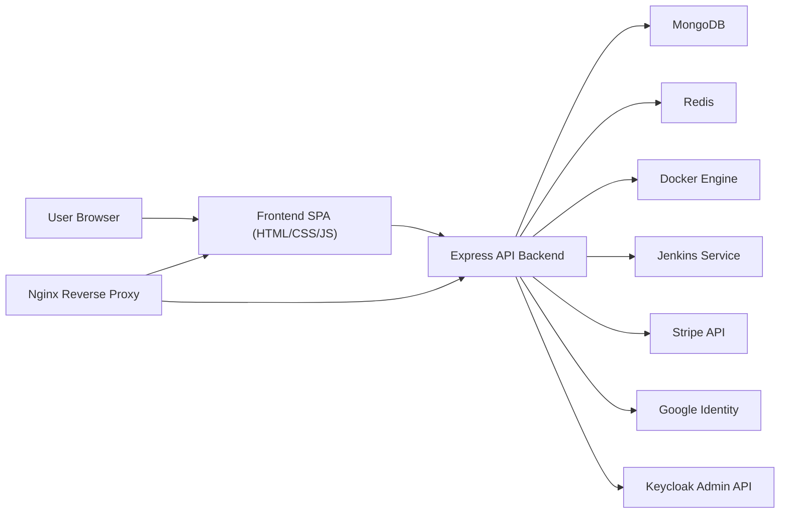

# ByteSky Cloud Project Report Content

This draft is written in a black-book style so it can be adapted into a college project report. It is based on the current repository implementation of ByteSky Cloud. Where relevant, the wording reflects what is actually implemented in code, including parts that are simulated or prototype-level.

## Project Title

Design and Development of ByteSky Cloud: A Unified Cloud Service Management Platform

## Abstract

ByteSky Cloud is a full-stack cloud management platform developed to demonstrate how modern cloud services can be unified inside a single web-based control panel. The project combines a static single-page frontend with a Node.js and Express backend, MongoDB for persistent data storage, Redis for caching, Docker-based service orchestration, and support utilities such as Nginx, Jenkins, Stripe, Google authentication, and Keycloak integration. The system enables users to register and authenticate, manage compute instances, launch browser-accessible virtual machine sessions, create storage buckets, upload and download files, define virtual private cloud resources, monitor resource metrics, raise support tickets, manage identity and access permissions, generate invoices, and interact with deployment-related services through a centralized interface.

One of the major strengths of the project is that it models multiple cloud domains together rather than implementing only a single feature. ByteSky Cloud includes infrastructure management, billing, monitoring, IAM, support operations, and DevOps workflows inside one application. Based on the present implementation, the project can be understood as a hybrid prototype: some modules are backed by real services such as Docker, Redis, Stripe, and Jenkins, while other cloud abstractions such as VM instance metrics, public IP allocation, and load balancer activation are simulated to demonstrate expected platform behavior. This makes the project suitable as an educational cloud platform, a portfolio-grade system design project, and a foundation for future expansion into a more production-ready cloud orchestration platform.

## Keywords

Cloud Computing, Node.js, Express.js, MongoDB, Redis, Docker, Jenkins, IAM, Billing, Monitoring, Virtual Machines, Storage Management, Support Ticketing

## 1. Introduction

Cloud computing platforms such as AWS, Azure, and Google Cloud provide users with a unified environment for provisioning compute, storage, networking, billing, and security resources. Building a cloud platform from scratch is a complex task because it requires integration of many independent modules, including user authentication, resource lifecycle management, monitoring, billing, and automation. ByteSky Cloud was developed to study and implement these ideas in a manageable project form.

The project provides a browser-based cloud console through which end users and administrators can access multiple cloud-inspired services. The frontend presents dashboard views for compute, storage, network, billing, support, IAM, monitoring, SaaS marketplace services, and administration. The backend exposes REST APIs that coordinate authentication, data persistence, invoice generation, audit logging, cache operations, Docker-backed sessions, and third-party integrations. In this sense, ByteSky Cloud is not only a web application but also a system integration project that demonstrates how different infrastructure and application services can work together inside one platform.

## 2. Problem Statement

Many academic cloud projects focus only on login systems, a single VM dashboard, or isolated CRUD operations. Such implementations do not adequately represent how real cloud platforms operate as multi-module ecosystems. There is therefore a need for a unified platform that demonstrates:

1. User and administrator access in a shared cloud console.
2. Compute, storage, network, billing, and support features in one system.
3. Secure authentication and role-based access control.
4. Monitoring, audit logging, and operational visibility.
5. Deployment and CI/CD integration for real-world relevance.

ByteSky Cloud addresses this problem by combining these services into a single integrated project.

## 3. Objectives

The main objectives of ByteSky Cloud are:

1. To design a centralized cloud management interface for users and administrators.
2. To implement secure authentication using JWT, password hashing, Google login, and two-factor authentication.
3. To support compute lifecycle management for instances and Docker-backed browser VM sessions.
4. To provide storage bucket creation, file upload, file download, and bucket caching support.
5. To simulate or manage cloud networking concepts such as VPCs, subnets, route tables, and load balancers.
6. To generate invoices and usage summaries for cloud resources.
7. To monitor system and instance activity through metrics and health endpoints.
8. To implement IAM, API key management, audit logging, and admin analytics.
9. To integrate DevOps support using Docker, Nginx, Jenkins, and GitHub Actions.
10. To create a project architecture that can be extended in the future toward a more production-ready cloud platform.

## 4. Scope of the Project

The scope of ByteSky Cloud covers both user-side and admin-side functionality.

### User Scope

- User registration, login, Google sign-in, and profile management
- Compute instance creation, start, stop, and termination
- Browser VM and container session launch
- Storage bucket and file management
- VPC, route table, and load balancer management
- Monitoring dashboards and usage statistics
- Billing, invoice viewing, payment initiation, and PDF invoice download
- Ticket creation, replies, and support tracking
- Notification viewing, API key generation, and 2FA setup

### Administrator Scope

- Viewing all users and updating roles
- Accessing platform analytics
- Managing support tickets
- Reviewing audit logs
- Managing policies through Keycloak-backed role operations

### Technical Scope

- REST API backend with Express.js
- MongoDB persistence for platform data
- Redis caching for bucket data
- Docker-backed service orchestration and VM-like sessions
- Jenkins-based CI/CD service management
- Nginx reverse proxy deployment

## 5. Existing System and Proposed System

### Existing System

In a traditional fragmented setup, authentication, compute management, billing, storage, and CI/CD are handled by separate tools. This increases operational complexity and creates a poor learning environment for understanding how cloud modules relate to each other.

### Proposed System

ByteSky Cloud provides a unified web-based console where these services are exposed through one interface and one backend API. The proposed system improves learning value, maintainability, and extensibility by consolidating core cloud management features into a common platform.

## 6. System Architecture

ByteSky Cloud follows a layered full-stack architecture.

### Architectural Layers

1. Presentation Layer: Static HTML, CSS, and JavaScript frontend functioning as a single-page cloud console.
2. Application Layer: Express.js backend handling routing, authentication, business logic, and integrations.
3. Data Layer: MongoDB models for users, instances, tickets, invoices, storage objects, IAM artifacts, metrics, and network resources.
4. Cache Layer: Redis used for temporary caching, especially for storage bucket listings.
5. Infrastructure Layer: Docker-managed services, Jenkins, Nginx, and container-backed VM sessions.

### High-Level Architecture

### Architectural Interpretation

The application behaves like a cloud control plane. The frontend presents service dashboards, the backend acts as the orchestration and policy layer, MongoDB stores service state, Redis improves response time for repeated storage queries, and Docker/Jenkins integrations provide operational features. Based on the implementation, some cloud resources are modeled in the database and simulated, while container-backed workflows are executed more directly through Docker APIs.

## 7. Technology Stack

### Frontend

- HTML5
- CSS3
- JavaScript
- Chart.js for visual analytics
- Stripe.js for payment workflow
- Google Identity Services for OAuth login

### Backend

- Node.js
- Express.js
- Mongoose
- JWT
- bcryptjs
- helmet
- cors
- express-rate-limit
- multer
- pdfkit
- socket-ready service integrations via HTTP and Docker APIs

### Database and Caching

- MongoDB
- Redis

### DevOps and Infrastructure

- Docker
- Docker Compose
- Nginx
- Jenkins
- GitHub Actions

## 8. Major Modules of the System

### 8.1 Authentication and User Management

The authentication module supports local user registration and login, Google-based login, JWT-based session handling, password hashing with bcrypt, profile editing, and retrieval of current user details. User roles include admin, developer, viewer, and user. The system also stores metadata such as auth provider, avatar, and last login time. A seeded admin account is created during initial startup if it does not already exist.

### 8.2 Compute and Instance Management

The compute module allows users to create, view, start, stop, and delete instances. When an instance is created, the system assigns a random internal-style IP address, calculates monthly and hourly cost based on size and regional pricing, stores the instance in MongoDB, and creates an invoice. Provisioning is simulated through a delayed status change from provisioning to running. This design makes the project suitable for demonstrating cloud instance lifecycle logic even though the instances are not full hypervisor-managed virtual machines.

### 8.3 Browser VM and Container Sessions

In addition to instance records, ByteSky Cloud includes a Docker-backed VM subsystem. Users can launch short-lived browser-accessible sessions backed by container images such as Ubuntu, Node.js, MongoDB, Redis, and MySQL. Ports are allocated dynamically within configured ranges, containers are auto-expired using TTL logic, and selected images expose browser URLs. This is one of the strongest practical infrastructure features in the project because it moves beyond pure CRUD modeling and actually interacts with Docker.

### 8.4 Storage Management

The storage module supports bucket creation, file upload, file download, file deletion, and per-bucket statistics such as object count and size. Uploaded files are stored on the local filesystem under user-specific and bucket-specific directories, while metadata is stored in MongoDB. Redis caching is used to speed up repeated bucket listing requests and is invalidated after bucket or file changes.

### 8.5 Networking Module

The networking module allows creation of VPCs, subnets, route tables, and load balancers. VPCs are created with default subnets, main route tables are automatically ensured, subnet associations are managed, and custom routes can be stored. Load balancer entries are created with DNS names and transition from provisioning to active after a delay. This module models common cloud networking concepts effectively, even though the implementation primarily stores these resources as application-level abstractions rather than provisioning actual network infrastructure.

### 8.6 Monitoring and Metrics

The monitoring subsystem provides health endpoints, metric summaries, historical charts, and per-instance metric retrieval. A background metrics service periodically generates CPU, RAM, disk, and network values for running instances and stores them in the Metric collection. These values are then consumed by the monitoring routes and visualized in the frontend dashboard using Chart.js.

### 8.7 Billing and Invoicing

Billing is implemented using invoice generation, usage summaries, manual payment marking, Stripe checkout integration, and PDF invoice export. Launching an instance generates an invoice, terminating an instance can generate a prorated final invoice, and completed payments are written into the audit log. The PDF invoice generator creates downloadable invoice documents using PDFKit.

### 8.8 Support and Notifications

The support module provides a ticketing system with priorities, statuses, threaded replies, message history, attachment upload, assignment, and admin management. When tickets are created or updated, notifications are generated for users or admins. This module strengthens the project by showing that the platform is not only about infrastructure provisioning but also about operational support workflows.

### 8.9 IAM, API Keys, and Policy Control

The IAM module supports user listing, role updates, policy management, API key generation, audit log access, and permission checks. API keys are generated as key-secret pairs and can be revoked later. The project also integrates with Keycloak admin endpoints for listing, creating, and deleting realm roles. This introduces external identity-provider support into the system and demonstrates enterprise-style access control ideas.

### 8.10 Admin Analytics and Platform Control

The admin module aggregates platform-wide analytics such as total users, running instances, revenue totals, ticket counts, regional revenue, top-paying users, and audit log volume. It also includes endpoints for user management, support ticket management, and resource review. This gives the project a control-plane feel similar to real cloud provider admin consoles.

### 8.11 DevOps and CI/CD Services

ByteSky Cloud includes Docker Compose definitions, Nginx reverse proxying, Jenkins service lifecycle management, Jenkins bootstrap automation, and GitHub Actions CI. Jenkins can be launched as a managed container, preconfigured with a build job, and triggered from the platform. GitHub Actions performs basic backend syntax validation and Docker Compose validation. This module increases the practical relevance of the project from both deployment and operational perspectives.

## 9. Frontend Design and User Interaction

The frontend is implemented as a static single-page application. It contains routed views for Home, Login, Register, Dashboard, Compute, Network, SaaS Marketplace, Monitoring, Storage, Support, IAM, Billing, Profile, and Admin. The frontend stores session tokens in local storage, communicates with backend APIs using fetch, renders charts through Chart.js, and dynamically updates the console according to the current module.

The dashboard acts as a central summary view and provides quick actions such as launching instances, creating buckets, opening the support system, and starting browser VM sessions. This interface style mirrors the behavior of a lightweight cloud console, making the project visually and functionally cohesive.

## 10. Database Design

The database layer is centered on MongoDB collections created through Mongoose models. Important collections include:

- `User`: Stores identity, email, password hash, role, provider, policies, 2FA fields, and last login.
- `Instance`: Stores VM-like compute instances, pricing, ownership, lifecycle state, and embedded metrics snapshot history.
- `VirtualMachine`: Stores Docker-backed VM session state, port allocation, expiry time, and container identifiers.
- `ContainerSession`: Stores container marketplace session details.
- `Invoice`: Stores billing entries, invoice numbers, amounts, items, status, and payment timestamps.
- `Bucket`: Stores user-created storage buckets and configuration.
- `StorageObject`: Stores uploaded file metadata and filesystem path.
- `VPC`, `RouteTable`, `LoadBalancer`: Store networking resource definitions.
- `Metric`: Stores time-series performance metrics.
- `Ticket`: Stores support issue records, replies, attachments, and change history.
- `Notification`: Stores system notifications for users.
- `APIKey`: Stores generated API credentials and permission scopes.
- `TwoFA`: Stores TOTP secret, backup codes, and enablement state.
- `AuditLog`: Stores security and operational events.
- `Region`: Stores regional pricing and capacity metadata.

This schema design allows the project to model a wide set of cloud service entities in a structured way.

## 11. Core Workflows

### 11.1 User Registration and Login Workflow

1. The user submits registration or login details from the frontend.
2. The backend validates the request and stores or verifies credentials.
3. Passwords are hashed using bcrypt before storage.
4. After successful authentication, a JWT token is generated.
5. The token is stored on the client and attached to future API requests.
6. An audit log is written for important login and registration events.

### 11.2 Compute Provisioning Workflow

1. The user submits instance configuration such as name, OS, size, and region.
2. The backend calculates pricing using region multipliers.
3. A new instance record is created in MongoDB with provisioning state.
4. An invoice is generated for the launched resource.
5. After a simulated delay, the instance state changes to running.
6. Monitoring data and billing usage can be tracked later.

### 11.3 Browser VM Lifecycle Workflow

1. The user selects a supported image from the marketplace.
2. The backend checks user limits and searches for an available host port.
3. Docker image presence is validated or pulled if missing.
4. A container is created and started through Docker APIs.
5. A public access URL is generated for supported images.
6. The session is stored in MongoDB and scheduled for automatic cleanup.

### 11.4 Storage Workflow

1. The user creates a bucket.
2. A user-specific directory is created on disk.
3. Files are uploaded through multer and stored in the uploads hierarchy.
4. Metadata is stored in MongoDB.
5. Redis cache entries for bucket listings are invalidated and regenerated.

### 11.5 Ticket Workflow

1. The user creates a support ticket with subject, description, and optional attachments.
2. The ticket is stored with history and threaded messages.
3. Notifications are sent to administrators.
4. Admins can update status, priority, or assignment.
5. Replies from either side are stored in the message timeline.

## 12. Security Features

ByteSky Cloud includes multiple security-oriented features:

1. Password hashing using bcrypt.
2. JWT-based authentication middleware.
3. Helmet for secure HTTP headers.
4. CORS origin control.
5. API rate limiting to reduce abuse.
6. Two-factor authentication using TOTP and QR code generation.
7. Audit logs for authentication, billing, and admin actions.
8. API key generation and revocation.
9. Role-based access restrictions for administrative routes.
10. Keycloak-backed policy integration for extended IAM control.

These features make the project stronger than a typical CRUD system because security is treated as a core platform requirement.

## 13. Deployment and DevOps

The project includes strong deployment-oriented components. The backend has a multi-stage Dockerfile for development and production. Docker Compose provisions Nginx, backend, MongoDB, and Redis together. Nginx serves the frontend and proxies `/api` and `/uploads` requests to the backend. The Jenkins integration can launch a containerized CI/CD service and bootstrap a build job automatically. GitHub Actions adds a second CI mechanism by checking backend syntax and validating Docker Compose configuration.

This deployment setup shows that the project was designed not only to run locally but also to reflect real operational practices such as reverse proxying, health checks, isolated services, persistent volumes, and containerized automation.

## 14. Testing and Validation

The current repository includes basic validation support but limited automated testing.

### Verification Observed in the Project

- Backend entry files are syntactically valid.
- Frontend main script is syntactically valid.
- GitHub Actions validates backend syntax and Docker Compose configuration.
- Application health routes expose live and ready checks.

### Current Testing Gap

There are no implemented automated unit tests, integration tests, or end-to-end tests. The `npm test` scripts currently return placeholder messages. Therefore, the present testing approach is mainly based on manual verification and startup validation rather than a full automated quality pipeline.

## 15. Results and Outcome of the Project

ByteSky Cloud successfully demonstrates the design of a cloud-inspired service management platform with multiple integrated domains. The project produces the following outcomes:

1. A unified cloud console for users and administrators.
2. Working authentication and account management.
3. Compute lifecycle and Docker-backed browser VM sessions.
4. File storage with metadata and caching support.
5. Network resource modeling for VPC, route tables, and load balancers.
6. Billing and invoice generation with payment integration.
7. Monitoring dashboards and background metric collection.
8. Support ticketing and notification workflows.
9. IAM, audit logging, and admin analytics.
10. Containerized deployment and CI/CD integration.

These results indicate that the project meets its educational and architectural goals effectively.

## 16. Limitations

The current implementation also has some important limitations:

1. Many cloud resources are simulated at the application layer rather than provisioned on real infrastructure.
2. Instance metrics are generated artificially instead of collected from real hypervisor or VM telemetry.
3. Load balancer and networking modules are modeled logically but do not create true network infrastructure.
4. Automated tests are missing.
5. Some third-party integrations depend on environment configuration and may not function without external services being available.
6. The system is not yet optimized for multi-tenant production scale.

These limitations are acceptable for a prototype or academic cloud project, but they define clear areas for future enhancement.

## 17. Future Scope

The future scope of ByteSky Cloud is significant. The following improvements can extend the system:

1. Replace simulated instance management with actual VM orchestration using Kubernetes, KVM, Firecracker, or cloud provider APIs.
2. Collect real performance metrics through Prometheus, node exporters, and container telemetry.
3. Add automated unit, integration, and end-to-end tests.
4. Introduce WebSocket-based live monitoring and live notification delivery.
5. Add stronger secrets management and remove client-side fallback configuration values.
6. Extend IAM with policy editors, group-based access, and more granular resource permissions.
7. Add object versioning, lifecycle rules, and signed URL access for storage.
8. Support advanced billing analytics, subscription plans, and usage forecasting.
9. Add Terraform-style infrastructure templates and deployment blueprints.
10. Improve production readiness with observability dashboards, backup strategies, and horizontal scaling.

## 18. Conclusion

ByteSky Cloud is a well-scoped and ambitious cloud platform project that demonstrates the integration of many important cloud computing concepts inside a single application. It goes beyond basic web development by combining authentication, infrastructure modeling, billing, monitoring, IAM, support workflows, Docker-backed services, and CI/CD features. The project is especially strong as an academic or portfolio system because it demonstrates both breadth and technical coordination across multiple domains.

Based on the implemented code, ByteSky Cloud should be described as a prototype cloud management platform with a mix of real integrations and simulated infrastructure behavior. This is not a weakness; rather, it shows a practical engineering approach to modeling complex cloud concepts in a form that is achievable within a project environment. With further work in testing, infrastructure orchestration, and operational maturity, ByteSky Cloud can evolve into an even more realistic cloud platform.

## 19. Suggested Screenshots for the Report

You can strengthen the final report by adding screenshots of:

1. Home page
2. Login and registration pages
3. Dashboard overview
4. Compute instances page
5. Browser VM launch panel
6. Network and VPC management page
7. Storage buckets and file upload page
8. Monitoring dashboard with charts
9. Billing and invoice page
10. Support ticket page
11. IAM and API key page
12. Admin analytics dashboard
13. Docker marketplace and Jenkins service controls

## 20. Suggested Diagrams to Include

The final black-book report should ideally include:

1. System architecture diagram
2. Use case diagram for user and admin roles
3. Data flow diagram
4. ER diagram based on key MongoDB models
5. Sequence diagram for login workflow
6. Sequence diagram for VM launch workflow
7. Deployment diagram showing frontend, backend, MongoDB, Redis, Docker, and Jenkins

## 21. Suggested References

1. Node.js official documentation
2. Express.js official documentation
3. MongoDB official documentation
4. Mongoose official documentation
5. Redis official documentation
6. Docker official documentation
7. Nginx official documentation
8. Jenkins official documentation
9. Stripe developer documentation
10. Google Identity documentation
11. Keycloak documentation

## 22. Practical Summary for Viva or Presentation

If the project is presented in a viva, it can be summarized as follows:

ByteSky Cloud is a unified cloud service management platform that combines compute, storage, networking, monitoring, billing, IAM, support, and DevOps operations inside one web application. The frontend acts as a cloud console, while the backend uses Node.js, MongoDB, Redis, Docker, and external integrations to manage service workflows. Some resources are simulated to represent real cloud behavior, while others, especially Docker-backed sessions and CI/CD service controls, are implemented more directly. The project demonstrates both software engineering depth and cloud architecture understanding.
